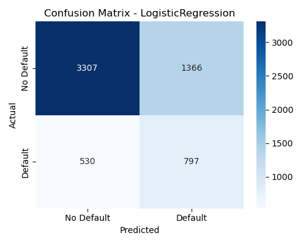
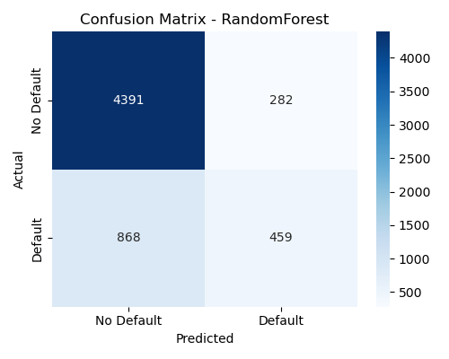
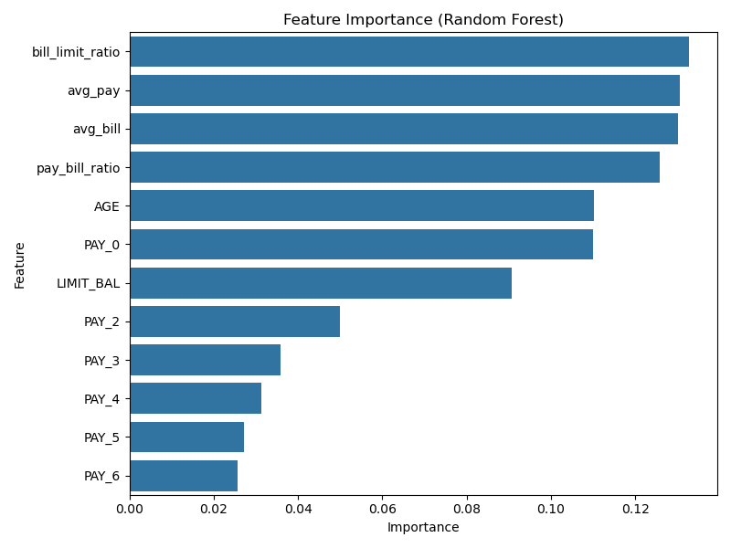

# Loan Default Prediction Model

This project predicts credit card client defaults using the **UCI Default of Credit Card Clients dataset**. It demonstrates the full machine learning workflow: feature engineering, model training, evaluation, and extracting insights for financial risk assessment.

## Features
- Preprocessed and engineered key features such as **bill-to-limit ratio** and **pay-to-bill ratio**.
- Trained and compared **Logistic Regression** (baseline) and **Random Forest** (higher performance).
- Exported results into **text, CSV, and PNG** files for easy reporting.
- Visualized **confusion matrices** and **feature importance**.
- Identified key risk drivers including repayment history, bill ratios, and credit limit.

## Tech Stack
- **Python** (pandas, numpy, scikit-learn, matplotlib, seaborn)
- Models: **Logistic Regression** and **Random Forest**
- Data Source: [UCI Default of Credit Card Clients](https://archive.ics.uci.edu/ml/datasets/default+of+credit+card+clients)

## Results
### Logistic Regression
- Accuracy: **68.4%**
- ROC-AUC: **0.705**
- Better recall on defaults (60%) but lower overall precision.

### Random Forest
- Accuracy: **80.8%**
- ROC-AUC: **0.747**
- Strong overall accuracy, excellent at predicting non-defaults (94% recall).

### Feature Importance
Top predictive factors:
1. Bill-to-limit ratio  
2. Average payment  
3. Average bill amount  
4. Pay-to-bill ratio  
5. Age  
6. Most recent repayment status (PAY_0)

## How It Works
1. Load and preprocess the UCI dataset (30,000 client records).
2. Engineer new financial ratios to capture risk exposure.
3. Train and evaluate Logistic Regression and Random Forest.
4. Save evaluation results to `model_results.txt` and `.csv` files.
5. Generate confusion matrices and feature importance plots as `.png`.

## Why I Built This
Credit risk prediction is central to banking and finance.  
This project shows how machine learning can:
- Automate **default risk scoring**,
- Extract **insights for credit analysts**,
- And reduce potential financial losses by highlighting high-risk clients.

It also demonstrates my ability to combine **data science skills** with **business impact**.

## Next Steps
- Apply hyperparameter tuning (GridSearchCV / RandomizedSearchCV).
- Experiment with **XGBoost** and **LightGBM**.
- Deploy as a **Streamlit app** for interactive risk scoring.
- Integrate into a **dashboard** for real-time monitoring.

---

*Built as part of my Data Science portfolio.*
